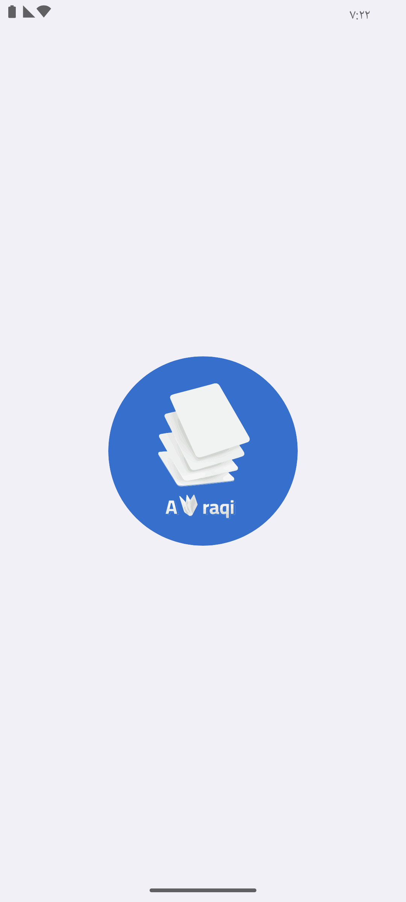

# 📚 Awraqi

Awraqi is an Android app designed to help students by providing summarized notes and study papers, making studying easier and more efficient. Whether you want quick access to study materials or keep track of your favorites, Awraqi is here to support your learning journey.

## 📲 Features

- 📖 **Summarized Notes & Study Papersn**
  - The user has access to a variety of study papers and summarized notes.
     
  
   &nbsp; &nbsp; &nbsp;&nbsp;&nbsp;&nbsp;&nbsp;
  

- 📂 **Offline Access & Downloads**
  - The user can download files which is encrypted and saved in the device storage.
    
  

- 📄 **Advanced PDF Viewer**
  - Highlight important text.
  - Draw and annotate directly on PDFs.
  - Add personal notes for revision.
  - Smooth scrolling and intuitive interface.
     
   

- 🔐 **Secure Authentication**
  - Sign in with Firebase Authentication for a seamless and secure user experience.
      
    
 
- 🌙 **Night Mode**
  - Switch to a dark theme for a comfortable viewing experience.
     
  
   
- 🌐 **Multi-language Support**
  - Available in both English and Arabic.

## ⚙️ Tech Stack

- **Language:** Kotlin  
- **UI:** XML  
- **Architecture:** MVVM   
- **Local Storage:** Room, Jetpack DataStore  
- **Dependency Injection:** Koin  
- **PDF Viewer:** Custom implementation supporting annotation, highlight, drawing  
- **Image Loading:** Glide  
- **Coroutines:** Kotlin Coroutines for async tasks  
- **Navigation:** Jetpack Navigation  

### 🔥 Firebase Services

- **Authentication** — user login/signup  
- **Firestore** — real-time data storage  
- **Cloud Messaging** — push notifications  
- **Storage** — study material storage  
- **Crashlytics** — crash tracking  
- **Analytics** — user behavior insights  

## 📥 Download Awraqi
📲 available on the Google Play Store: [Google Play Link](https://play.google.com/store/apps/details?id=com.dev3mk.awraqi)
